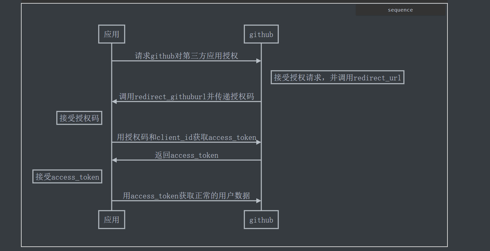

# Github认证调研

### Github认证调研

我使用了阿里云和百度云的镜像服务中的代码库绑定，绑定了github，所以在github的设置中的application中可以看到如下显示：

 

百度云使用了OAuth App


阿里云使用的权限


阮一峰将的auth2.0。将的很好，接了我很多的疑惑，尤其是更新令牌那块，[阮一峰的文章](http://www.ruanyifeng.com/blog/2019/04/github-oauth.html)

#### 第三方登录原理

所谓第三方登录，实质就是 OAuth 授权。用户想要登录 A 网站，A 网站让用户提供第三方网站的数据，证明自己的身份。获取第三方网站的身份数据，就需要 OAuth 授权。举例来说，A 网站允许 GitHub 登录，背后就是下面的流程: 1. A 网站让用户跳转到 GitHub。 2. GitHub 要求用户登录，然后询问"A 网站要求获得 xx 权限，你是否同意？" 3. 用户同意，GitHub 就会重定向回 A 网站，同时发回一个授权码。 4. A 网站使用授权码，向 GitHub 请求令牌。 5. GitHub 返回令牌. 6. A 网站使用令牌，向 GitHub 请求用户数据。

### Github认证流程详解

简单看下github认证的时序图，后面会一一讲解



#### 登记

一个应用要求 OAuth 授权，必须先到对方网站登记，让对方知道是谁在请求。 所以，你要先去 GitHub 登记一下。[登记网址](https://github.com/settings/applications/new) 应用的名称随便填，主页 URL 填写`http://localhost:8080`，跳转网址填写 `http://localhost:8080/oauth/redirect`。提交表单以后，GitHub 应该会返回客户端 ID（client ID）和客户端密钥（client secret），这就是应用的身份识别码: 

#### 请求github用户授权

用户授权就是请求：

```markup
https://github.com/login/oauth/authorize?client_id=65210525ee9827b8d328&redirect_uri=http://localhost:8080/oauth/redirect&state=zhouyu
```

解释下state可以用作当前用户的标识，因为有很多用户在申请授权，根据回调的url中的state可以进行区分。此外上面的授权是普通授权，需要在参数中加入scope，在此不做演示。`client_id`告诉 GitHub 谁在请求，`redirect_uri`是稍后登陆完后跳转回来的网址。用户点击到了 GitHub，GitHub 会要求用户登录，确保是本人在操作。

#### 返回授权码

登录后，GitHub 询问用户，该应用正在请求数据，你是否同意授权。 用户同意授权， GitHub 就会跳转到`redirect_uri`指定的跳转网址，并且带上授权码，跳转回来的 URL 就是下面的样子。

> ```markup
> http://localhost:8080/oauth/redirect?
>   code=859310e7cecc9196f4af
> ```

后端收到这个请求以后，就拿到了授权码（`code`参数）。

#### 用授权码获取access\_token

针对`/oauth/redirect`的请求，编写一个[路由](https://github.com/ruanyf/node-oauth-demo/blob/master/index.js#L16)，完成 OAuth 认证，其实就是解析github返回的授权码

后端使用这个授权码，向 GitHub 请求令牌。


#### 返回 access\_token

作为回应，GitHub 会返回一段 JSON 数据，里面包含了令牌`access_token`。


#### 用access\_token正常请求

有了令牌以后，就可以向 API 请求数据了。比如请求user的数据，把token放在Header里，格式

Authorization: token OAUTH-TOKEN


返回结果：

```text
{
    "login": "fishingfly",
    "id": 29742631,
    "node_id": "MDQ6VXNlcjI5NzQyNjMx",
    "avatar_url": "https://avatars2.githubusercontent.com/u/29742631?v=4",
    "gravatar_id": "",
    "url": "https://api.github.com/users/fishingfly",
    "html_url": "https://github.com/fishingfly",
    "followers_url": "https://api.github.com/users/fishingfly/followers",
    "following_url": "https://api.github.com/users/fishingfly/following{/other_user}",
    "gists_url": "https://api.github.com/users/fishingfly/gists{/gist_id}",
    "starred_url": "https://api.github.com/users/fishingfly/starred{/owner}{/repo}",
    "subscriptions_url": "https://api.github.com/users/fishingfly/subscriptions",
    "organizations_url": "https://api.github.com/users/fishingfly/orgs",
    "repos_url": "https://api.github.com/users/fishingfly/repos",
    "events_url": "https://api.github.com/users/fishingfly/events{/privacy}",
    "received_events_url": "https://api.github.com/users/fishingfly/received_events",
    "type": "User",
    "site_admin": false,
    "name": null,
    "company": null,
    "blog": "",
    "location": null,
    "email": null,
    "hireable": null,
    "bio": null,
    "public_repos": 22,
    "public_gists": 0,
    "followers": 1,
    "following": 0,
    "created_at": "2017-06-28T00:43:10Z",
    "updated_at": "2020-02-15T03:26:52Z"
}
```

要是需要展示仓库信息的话，需要在认证时加入scope。例如

```text
https://github.com/login/oauth/authorize?client_id=65210525ee9827b8d328&redirect_uri=http://localhost:8080/oauth/redirect&state=zhouyu&scope=repo
```

scope除了写repo之外，还能写别的权限：参考这个连接

[https://developer.github.com/apps/building-oauth-apps/understanding-scopes-for-oauth-apps/](https://developer.github.com/apps/building-oauth-apps/understanding-scopes-for-oauth-apps/)


拿到code后，再次去调[https://github.com/login/oauth/access\_token](https://github.com/login/oauth/access_token) 接口，返回的值是这样的：

```text
access_token=cfee603fe634bb638bb21bb0dabeaa4d09232790&scope=repo&token_type=bearer
```


上面这张图片是获取了用户的所有仓库。

[https://github.com/google/go-github](https://github.com/google/go-github) 这个是github的V3api的go代码库，方便开发，里面有认证相关的api。

[https://developer.github.com/apps/building-oauth-apps/authorizing-oauth-apps/](https://developer.github.com/apps/building-oauth-apps/authorizing-oauth-apps/) 官方认证流程在这

今年可能废弃的请求（token不要放url中就没问题）

[https://developer.github.com/changes/2020-02-10-deprecating-auth-through-query-param/](https://developer.github.com/changes/2020-02-10-deprecating-auth-through-query-param/) 废弃验证中Token放在请求url中的认证请求。这部分认证请求会在2020年5月废除。之前的使用者将受到401状态码返回值。 \[auth认证参考文章\]\([https://github.com/ZJH9Rondo/Blog-Node/wiki/Github%E7%AC%AC%E4%B8%89%E6%96%B9%E8%AE%A4%E8%AF%81%E7%99%BB%E5%BD%95%E5%AE%9E%E7%8E%B0](https://github.com/ZJH9Rondo/Blog-Node/wiki/Github第三方认证登录实现)\) [github的api概览](https://developer.github.com/v3/previews/)

